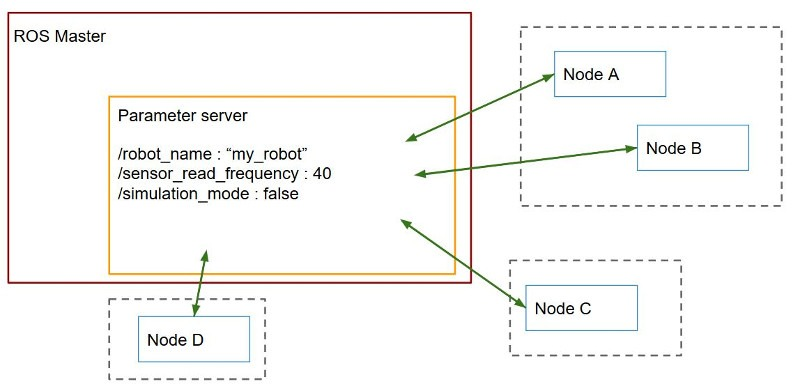

**ROS**, which means the Robot Operating System, is a set of software libraries and tools to help you build robot applications. It provides hardware abstraction, device drivers, libraries, visualizers, message-passing, package management, and more. The point of ROS is to create a **robotics standard**, so you don't need to reinvent the wheel anymore when building new robotic software.

### Main Objectives of this Workshop:
1. The objective of this course is to give you the basic tools and knowledge to be able to understand and create any basic ROS related project. You will be able to move robots, read their sensor data, make the robots perform intelligent tasks, see visual representations of complex data such as laser scans and debug errors in the programs.
1. This will allow you to understand the packages that others have done. So you can take ROS code made by others and understand what is happening and how to modify it for your own purposes
1. This can serve as an introduction to be able to understand the ROS documentation of complex ROS packages for object recognition, text to speech, navigation and all the other areas where ROS developed code.


# Week_0

* __Ubuntu Installation__ :
For using ROS framework Ubuntu is necessary. So, follow any of the four alternatives for setting up the linux environment:
(It's Preferable that you install Ubuntu 20.04)
**Dual-boot**: Follow this [Tutorial](https://towardsdatascience.com/how-to-dual-boot-windows-10-and-linux-ubuntu-20-04-lts-in-a-few-hassle-free-steps-f0e465c3aafd) or this [Video Tutorial](https://www.youtube.com/watch?v=-iSAyiicyQY) to install ubuntu in your laptop.  
<span style="color:red">[WARNING], Do at your own risk! We will be not responsible if you lose your data. __Follow instructions carefully and make backups before you start!__</span> <br />
**Virtual Machine** : You can install a virtual machine and install ubuntu on that. Follow this [Tutorial](https://www.youtube.com/watch?v=x5MhydijWmc) in that case. (Installation of the Virtual Machine is also included in the tutorial)
**WSL** : Follow this [Tutorial](https://www.windowscentral.com/install-windows-subsystem-linux-windows-10) to install WSL on your windows system.


* __Get familiar with Linux__:
Here are a few resources that you can refer to in order to get familiar with Linux:
	* [Video-based Tutorial](https://www.youtube.com/watch?v=IVquJh3DXUA "Introduction to Linux and Basic Linux Commands for Beginners")
	* [Text-based Tutorial](https://ryanstutorials.net/linuxtutorial/ "Linux Tutorial")
	
To install **Terminator**, run the following command in the terminal:  
```bash
sudo apt-get install terminator
```
It's highly recommended to use this application instead of stock Terminal. You can have tabs or split windows into few terminals.

* __ROS Installation/setup__:
	- For Ubuntu 20.04: [ROS Noetic Ninjemys](http://wiki.ros.org/noetic/Installation/Ubuntu)
	- For Ubuntu 18.04: [ROS Melodic Morena](http://wiki.ros.org/melodic/Installation)    
Go to a particular link and put your first step in the world of ROS.


### **Getting started with the ROS:**

*Now that the installation is done, let’s dive into ROS!*

#### **What is ROS?**

ROS is a software framework for writing robot software. The main aim of ROS is to reuse the robotic software across the globe. ROS consists of a collection of tools, libraries, and conventions that aim to simplify the task of creating complex and robust robot behavior across a wide variety of robotic platforms.
The official definition on ROS wiki is:

*ROS is an open-source, meta-operating system for your robot. It provides the services you would expect from an operating system, including hardware abstraction, low-level device control, implementation of commonly-used functionality, message-passing between processes, and package management. It also provides tools and libraries for obtaining, building, writing, and running code across multiple computers. ROS is similar in some respects to ‘robot frameworks, such as Player, YARP, Orocos, CARMEN, Orca, MOOS, and Microsoft Robotics Studio.*

#### **Basics of ROS**

First of all, let us start with the basics of ROS.
Go through the beginner level [Tutorials](http://wiki.ros.org/ROS/Tutorials). It will cover all the basics materials like how to create a package, what is a node and how to make it, what is a publisher and a subscriber? It will give you a detailed introduction to each and every thing. There are **20** parts to this tutorial, go through them all. Don't go to the intermediate level right now if you get done with the beginner level. We will give you an assignment based on these topics. **Write code on your own. Don't copy paste it directly.**  You will grasp the topics covered better when you try the implementation on your own. Assignment will be releasd soon. It's preferable if you use __Python__ instead of __C++__ as python syntax is easier and more readable and you will need it in future for sure, so, better learn it right now. These assignments will require knowledge of only basic python syntax.

Here, we are briefing about what is a package and how to create a package. This is also given in the tutorials, but we are telling this explicitly because it is the most fundamental thing that you have to do when you start with ROS.

##### **What is a package?** 

ROS uses **packages** to organize its programs. You can think of a package as **all the files that a specific ROS program contains**; all its CPP files, python files, configuration files, compilation files, launch files, and parameter files. All those files in the package are organized with the following structure:

* __launch__ folder: Contains launch files
* __src folder__: Source files (CPP, python)
* __CMakeLists.txt__: List of CMake rules for compilation
* __package.xml__: Package information and dependencies

To go to any ROS package, ROS gives you a command called `roscd`. Type:

`roscd <package_name>`

It will take you to the path where the package *package_name* is located. `roscd`  is a command which will get you to a ROS package location. `ls`is a command that lists the content of a folder.

* Every ROS program that you want to execute is organized in a package
* Every ROS program that you create will have to be organized in a package
* Packages are the main organizational system of ROS programs


##### **Create a package**

Until now we’ve been checking the structure of an already-built package. But now, let’s create one ourselves. When we want to create packages, we need to work in a very specific ROS workspace, which is known as the catkin workspace. The **catkin workspace** is the directory in your hard disk where your own ROS packages must reside in order to be usable by ROS. Usually, the catkin workspace directory is called *catkin_ws* .

Usually, the *catkin_ws* is created in the home folder of your user account. The catkin workspace has been already created and initialized for you.

Go to the src folder inside *catkin_ws* :

```bash
cd ~/catkin_ws /src
```

The *src* directory is the folder that holds created packages. Those could be your own packages or packages that you copied from other sources e.g. A Github Repository.

In order for the ROS system to recognize the packages in your *catkin_ws*, it needs to be on the ROS file path. ROS file path is an Ubuntu environment variable that holds the paths to ROS packages. To add our *catkin_ws* to the ROS file path follow the following instructions.

First, build (compile) your workspace. It’s OK to build the *catkin_ws*  even if it has no packages. After the build process, some new folders will appear inside your *catkin_ws* . One of the folders, called *catkin_ws* /devel contains a setup file that will be used to add the path of the *catkin_ws*  to the ROS file path. Build the *catkin_ws*  using the catkin build inside the *catkin_ws* :

```bash
cd ~/catkin_ws 	# Navigate to the catkin_ws
catkin build 	# Build
```
Now, let’s add the *catkin_ws*  path. Execute the following command while inside *catkin_ws* :

```bash
source devel/setup.bash
```
This adds the *catkin_ws*  path in the current terminal session but once you close the terminal window, it forgets it! So, you will have to do it again each time you open a terminal in order for ROS to recognize your workspace! Yeah, I know, that sucks! But no worries, there is a solution. You can automate the execution of the above command each time you open a terminal window. To do that, you want to add the above command to a special file called .bashrc that is located inside your home folder.

```bash
cd ~		# go to the home folder
nano .bashrc	# open the .bashrc file
```
Add the command `source ~/catkin_ws/devel/setup.bash` to the end of *.bashrc*.  
Then, hit <kbd>CTRL</kbd>+<kbd>X</kbd>, then, <kbd>Y</kbd>, to save the changes to the file.

Now, you can refer to the [tutorials](http://wiki.ros.org/ROS/Tutorials#Beginner_Level) on ROS wiki for further instructions.

Go through the official tutorials mentioned above and the explanations given below to develop an intuitive understanding of the concepts.

***You are free to use a suitabe IDE while creating packages, nodes, etc. The most commonly used IDE is Visual Studio Code. You can install it in your Ubuntu system and install ROS VSCode Extention in the VSCode application.***

#### Nodes
One of the primary purposes of ROS is to facilitate communication between the ROS nodes. Every program in ROS is called a **node**. Every independent task can be separated into nodes which communicate with each other through channels. These channels are also known as **topics**.

For example, one node can capture the images from a camera and send the images to another node for processing. After processing the image, the second node can send a control signal to a third node for controlling a robotic manipulator in response to the camera view.

The main mechanism used by ROS nodes to communicate is by sending and receiving **messages**. The **messages** are organized into specific categories called **topics**. Nodes may **publish** messages on a particular topic or **subscribe** to a topic to receive information.

Common ROS tools:

`roscore`:The Main program to initiate ros. It sets up the basic architecture for the channels, allowing nodes to communicate.

`rosrun` is used to run a single ros program  (node).

`roslaunch` is used to automate launching multiple nodes at once.

There are tools like `rostopic` and `rqt_graph` which can be used to visualize the nodes’ communication in the current channels and their message transactions.

#### Topics
You use a topic when you need to send a data stream. The data stream is unidirectional. Some nodes can **publish** on the topic, some nodes can **subscribe** to the topic. There is no response from a subscriber to a publisher, the data is only going one way.

A topic has a message type. All publishers and subscribers on this topic must use the message type associated with the topic.

You can create a publisher or subscriber in any ROS supported language you want, directly inside ROS nodes.

When a node wants to publish something, it will inform the ROS master. When another node wants to subscribe to a topic, it will ask the ROS master form where it can get the data.
(The rosmaster package implements the ROS Master. Most programs will not need to interact with this package directly. The rosmaster is run automatically whenever `roscore` is run and all communication with the Master happens over XMLRPC APIs.)

Finally, a node can contain many publishers and subscribers for many different topics.

#### Publisher Subscriber Interface

Message passing in ROS happens with the Publisher Subscriber Interface provided by ROS library functions.

Creating a publisher or subscriber node is just like creating any other node. <br />
Go to the package (where you want to create these nodes), make a new directory or folder (Let us follow the convention followed in the official ROS tutorials and call the new folder "scripts"). Add the publisher node python script and the subscriber node python script in this new folder scripts.


##### Writing a simple Publisher Node

This is a basic publisher node python script (taken from the official ROS tutorials from the website, and comments are added to help you understand the working of each line):

```python
#!/usr/bin/env python
# license removed for brevity

#import the rospy package and the String message type 
import rospy
from std_msgs.msg import String

#function to publish messages at the rate of 10 per second
def talker():
    #define a topic to which the messages will be published
    pub = rospy.Publisher('chatter', String, queue_size=10)
    
    #initialize the Publisher node
    #Setting anonymous=True will append random integers at the end of the publisher node
    rospy.init_node('talker', anonymous=True)
    
    #publishes at a rate of 2 messages per second
    rate = rospy.Rate(10) # 10hz
    
    #Keep publishing the messages until the user interrupts
    while not rospy.is_shutdown():
        hello_str = "hello world %s" % rospy.get_time()
	
	#display the message on the terminal
        rospy.loginfo(hello_str)
	
	#publish the message to the topic
        pub.publish(hello_str)
	
	#rate.sleep() will help wait long enough to maintain the desired rate through the loop
        rate.sleep()

if __name__ == '__main__':
    try:
        talker()
    #to capture the Interrupt signals that could be thrown by rate.sleep()
    except rospy.ROSInterruptException:
        pass

```
##### Writing a simple Subscriber Node:

This is a basic subscriber node python script (taken from the official ROS tutorials from the website, and comments are added to help you understand the working of each line):

```python

#!/usr/bin/env python
import rospy
from std_msgs.msg import String

#Callback function to print the subscribed data on the terminal
def callback(data):
    rospy.loginfo(rospy.get_caller_id() + "I heard %s", data.data)

#Subscriber node function which will subscribe the messages from the Topic
def listener():
    
    #initialize the subscriber node called 'listener'
    rospy.init_node('listener', anonymous=True)
    
    #This is to subscribe to the messages from the topic named 'chatter'
    rospy.Subscriber("chatter", String, callback)

    # spin() simply keeps python from exiting until this node is stopped
    rospy.spin()

if __name__ == '__main__':
    listener()   
```

We have to make the python scripts executable. The command for that:

```python

chmod +x <name of the python script>.py

```

Here, in place of "name of the python script", put the name of the python script that is added to the folder. You should run this command everytime you add a python script to the package.
	
And, add this snippet
```python
	
catkin_install_python(PROGRAMS scripts/<name of the publisher python script>.py scripts/<name of the subscriber python script>.py
  DESTINATION ${CATKIN_PACKAGE_BIN_DESTINATION}
)
	
```
to your 'CMakeLists.txt'.
	
Finally, go to catkin_ws and compile

```python
	
cd ~/catkin_ws
catkin_make
	
```

#### Services

A ROS service is a client/server system

Services are another way to pass data between nodes in ROS. Services are just synchronous remote procedure calls, they allow one node to call a function that executes in another node. Service calls are well suited to things that you only need to do occasionally and that take a bounded amount of time to complete.

A service is defined by a name, and a pair of messages. One message is the request, one message is the response. You must respect the format of the data on both sides of the communication.

You can directly create service clients and servers inside ROS nodes, using for example, the roscpp library for c++ and the rospy library for Python.

Finally, a service server can only exist once, but can have many clients. And basically, the service will be created when you create the server.

The first step in creating a client/server system is generating an srv file. Follow this [Tutorial](http://wiki.ros.org/ROS/Tutorials/CreatingMsgAndSrv#Creating_a_srv) for that.

##### Writing a simple Service Node:

This is a basic service node python script . In this example, the server adds two integers when requested by a client. (taken from the official ROS tutorials from the website, and comments are added to help you understand the working of each line):

```python

#!/usr/bin/env python

from __future__ import print_function
#AddTwoIntsResponse is generated from the AddTwoInts.srv file itself
from beginner_tutorials.srv import AddTwoInts,AddTwoIntsResponse
import rospy

#function that carries out the required computation (in this case, addition of two integers)
def handle_add_two_ints(req):
    # a and b are requested and added (a and b are variables from the service file AddTwoInts.srv)
    print("Returning [%s + %s = %s]"%(req.a, req.b, (req.a + req.b)))
    return AddTwoIntsResponse(req.a + req.b)

def add_two_ints_server():

    #initialize the server node
    rospy.init_node('add_two_ints_server')

    # declaring service name: add_two_ints, service type: AddTwoInts, and all requests are passed to ‘handle_add_two_ints’ function
    #this AddTwoInts is comapared with the one in the client file and as a callback function will go into the handle_add_two_ints function
    s = rospy.Service('add_two_ints', AddTwoInts, handle_add_two_ints)
    print("Ready to add two ints.")

    #keeps the code from exiting
    rospy.spin()

if __name__ == "__main__":
    add_two_ints_server()

  
  ```

##### Writing a simple Client Node:
 
This is a basic client node python script. It requests the server node to perform a task or a computation and recieves a response. (taken from the official ROS tutorials from the website, and comments are added to help you understand the working of each line):

```python

#!/usr/bin/env python
 
from __future__ import print_function
 
import sys
import rospy
#messsages are imported from the service folder of the package
from beginner_tutorials.srv import *
 
def add_two_ints_client(x, y):
    rospy.wait_for_service('add_two_ints')
    try:
        #this is the line that goes onto the service side
        #the AddTwoInts in this script is compared with the AddTwoInts of the server node script.      
        add_two_ints = rospy.ServiceProxy('add_two_ints', AddTwoInts)
        resp1 = add_two_ints(x, y)
        return resp1.sum
        #the AddTwoIntsResponse comes back here onto the client’s side and the response is printed.
    except rospy.ServiceException as e:
        print("Service call failed: %s"%e)
 
def usage():
    return "%s [x y]"%sys.argv[0]
 
if __name__ == "__main__":
    if len(sys.argv) == 3:
        #these inputs will be read from the terminal into the x and y given below
        x = int(sys.argv[1])
        y = int(sys.argv[2])
    else:
        print(usage())
        sys.exit(1)
    print("Requesting %s+%s"%(x, y))
    print("%s + %s = %s"%(x, y, add_two_ints_client(x, y)))
    
 ```
 The next steps are similar to the steps followed incase of Publisher and Subscriber nodes.
 
 
 A visual representation of nodes, topics, and services:

(Topics will be used for unidirectional data streams, and services will be used when you need a client/server architecture.)


#### Parameters

A centralized parameter server keeps track of a collection of values-things like integers, floating point numbers, strings, or other data-each identified by a short string name.

A ROS parameter is basically just one of the shared variable stored in the parameter server.
Ex:


In this example, we have 4 nodes included in 3 different packages. As you can see, any node from any package can get access to the ROS parameter server. The only condition is that the nodes should be on the same environment as the ROS master.

When node A is started, it can add a new parameter into the parameter server. If node B starts after node A, node B will have access to this new parameter.


